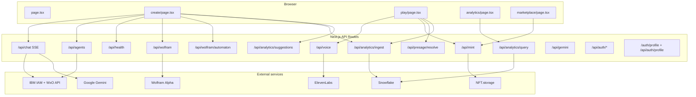

# Hoos Gaming — Full-Stack Audit Report

**Date:** 2026-03-22  
**Scope:** Repository as instrumented; runtime behavior depends on env (IBM WxO, Snowflake, Auth0, Gemini, ElevenLabs, NFT.storage, Presage, Wolfram).

---

## 1. Executive summary

Hoos Gaming is a **Next.js 14 App Router** product: **Create** streams game generation from **`/api/chat`** (IBM watsonx Orchestrate → optional Gemini → built-in demo HTML), **Play** runs games in a sandboxed iframe, **Analytics** reads Snowflake or static mock data, **Marketplace** lists/demo-mints via **NFT.storage** (not full on-chain minting), **Auth0** guards session via **`/api/auth/*`** and **`/auth/profile`**.

**Strengths:** Clear generation pipeline with multi-pass IBM assembly; rich engine prompts; health endpoint; defensive fallbacks (mock agents, demo game, mock analytics).

**Gaps addressed in remediation:** (a) **Snowflake writes** used hardcoded `HOOS_GAMING.ANALYTICS` while reads could use env-driven DB/schema — **fixed** via shared prefix. (b) **`navigator.sendBeacon`** sent JSON **without** `Content-Type: application/json` — **fixed** with `Blob`. (c) **SSE handler** referenced impossible `type === "demo"` — **fixed** to `type === "complete"` + `evt.demo`. (d) **`/api/analytics/suggestions`** was **unwired** — **wired** on Create. (e) Misleading **Gemini “1.5 Flash”** string in chat — **aligned** to model constant. (f) **Marketplace copy** overstated on-chain minting — **clarified**. (g) API routes lacked **purpose headers** — **added** on major routes.

**Remaining honest limitations (by design or scope):** No Auth0 enforcement on game/API routes (public app); Presage URL unverified against live docs; `/api/gemini` is a **testing** endpoint not used by the main UI; `AUTH0_ROUTES.accessToken` has **no** route file (SDK may not call it in this version).

---

## 2. System architecture overview

---

## 3. Feature inventory

| Feature | UI surface | Backend | Status |
|--------|------------|---------|--------|
| Landing / marketing | `page.tsx` | — | Static content |
| Game generation | `create/page.tsx` | `POST /api/chat` (SSE) | **Working** with WxO key; **fallback** Gemini; **demo** if both fail |
| Agent list sidebar | `create/page.tsx` | `GET /api/agents` | **Live** with `WXO_MANAGER_API_KEY`; else **mock** |
| Integration status chips | `create/page.tsx` | `GET /api/health` | **Working** (env flags only) |
| Wolfram enrichment | `create/page.tsx` | `GET /api/wolfram`, `GET /api/wolfram/automaton` | **Optional**; errors ignored client-side |
| Play iframe | `play/page.tsx` | Blob HTML + postMessage | **Working** |
| Voice intro | `play/page.tsx` | `GET/POST /api/voice` | **Working** if `ELEVENLABS_API_KEY` |
| NFT upload | `play/page.tsx`, `marketplace/page.tsx` | `POST /api/mint` | **IPFS upload**; not Solana program mint |
| Prediction market | `play/page.tsx` | `POST /api/presage/resolve` | **Mock** without key; **attempts** HTTP with key |
| Analytics dashboard | `analytics/page.tsx` | `GET /api/analytics/query` | **Snowflake** or **mock** |
| Generation analytics | `create/page.tsx` | `POST /api/analytics/ingest` | **Snowflake** or no-op response |
| Session analytics | `play/page.tsx` | `POST /api/analytics/ingest` + sendBeacon | **Fixed** beacon content-type |
| Prompt suggestions | Create (chips) | `GET /api/analytics/suggestions` | **Was unwired** — now **fetched** |
| Auth0 | `AuthButton`, layout | `/api/auth/login|logout|callback`, profile routes | **Working** when env set |
| Spec viewer | `spec/page.tsx` | sessionStorage | **Client-only** |
| Direct Gemini API | — | `POST /api/gemini` | **Manual/testing**; not main flow |

---

## 4. API inventory + audit

| Route | Purpose | Called by | Auth | Validation | Notes |
|-------|---------|-----------|------|------------|-------|
| `GET /api/health` | Env/config snapshot | Create | Public | — | No secrets |
| `GET /api/agents` | List WxO agents | Create | Public | — | Mock without manager key |
| `POST /api/chat` | SSE game generation | Create | Public | JSON body prompt | IBM → Gemini → demo |
| `POST /api/analytics/ingest` | Insert analytics rows | Create, Play | Public | JSON | **Was** hardcoded DB; **fixed** prefix |
| `GET /api/analytics/query` | Aggregate stats | Analytics page | Public | — | Mock if no Snowflake |
| `GET /api/analytics/suggestions` | Prompt fragments | **Create** (after fix) | Public | — | Static list; name is legacy |
| `GET/POST /api/voice` | ElevenLabs | Play | Public | JSON POST | 503 if no key |
| `GET /api/wolfram` | Wolfram Alpha query | Create | Public | `q` param | 503 if no app id |
| `GET /api/wolfram/automaton` | CA platform seed | Create | Public | bounded params | Pure compute |
| `POST /api/mint` | NFT.storage upload | Play, Marketplace | Public | gameCode, wallet | Not chain mint |
| `POST /api/presage/resolve` | Market resolve | Play | Public | body fields | Mock without key |
| `POST/GET /api/gemini` | Direct Gemini | External/manual | Public | prompt | Duplicate of chat fallback |
| `GET /api/auth/login` | Auth0 login | AuthButton | Public | — | Middleware |
| `GET /api/auth/logout` | Auth0 logout | AuthButton | Public | — | |
| `GET /api/auth/callback` | OAuth callback | Auth0 | Public | — | |
| `GET /api/auth/profile` | Session user JSON | useUser (optional) | Public | — | Alias of `/auth/profile` |
| `GET /auth/profile` | Session user JSON | Auth0 client default | Public | — | 204 if logged out |

---

## 5. Frontend wiring audit

- **Create → `/api/chat`:** Wired; parses SSE `data: ` frames; **fixed** `demo` detection (`evt.demo` on `complete`).
- **Create → suggestions:** **Was missing** — **now** loads and merges chip list.
- **Play → ingest (beacon):** **Was broken** for JSON parse — **fixed**.
- **Analytics page:** Only `query`; no link to ingest (OK).
- **Marketplace:** Mint calls `/api/mint` correctly; copy **clarified** vs on-chain.
- **Auth:** Login/logout hrefs correct; **no** route protection on `/create` or `/api/chat` (product choice).

---

## 6. Backend / service audit

- **snowflake.ts:** Connects with env + `app-config` database/schema; **ingest/query** now use **same** qualified namespace.
- **chat/route.ts:** Large monolith; IBM + Gemini + demo; **status string** updated for Gemini model name.

---

## 7. Security / reliability (severity)

| Severity | Finding | Mitigation |
|----------|---------|------------|
| **Info** | All generation/mint APIs are unauthenticated | Acceptable for demo; document for production |
| **Low** | `postMessage("*")` in iframe bridge | Same as prior; games are user-generated |
| **Low** | Presage endpoint URL may not match vendor | Document; mock path safe |
| **Medium** | SQL built with string concat in ingest | Uses `esc()`; keep inputs typed |

---

## 8. Database / integrations

- **Snowflake:** Tables assumed: `game_generations`, `play_sessions`, `modifications` under configured database.schema.
- **IBM:** `/api/chat` tries **`WXO_MANAGER_API_KEY`** first, then **`WXO_API_KEY`**. `/api/agents` uses **`WXO_MANAGER_API_KEY`** only (mock if missing).
- **NFT.storage:** Legacy service; upload API may evolve — errors surfaced to client.

---

## 9. Dead / partial / misleading code

- **`evt.type === "demo"`** in Create — **removed** (never sent).
- **`README` / `replit.md`** references to “Gemini 1.5” in chat — **code** now says 2.5 Flash where applicable; docs may still vary.
- **`/api/gemini`** — intentional standalone tester; not dead.
- **`accessToken` route** — missing file; monitor if Auth0 SDK upgrades require it.

---

## 10. Documentation gaps

- **WXO_MANAGER_API_KEY** is primary for chat + agents; **WXO_API_KEY** is optional fallback for chat only.
- Clarify **mint** = IPFS + metadata, not Metaplex mint transaction.
- Analytics **suggestions** are static, not Snowflake-driven (name is historical).

---

## 11–13. Remediation plan, file plan, verdict

**Done in repo (this pass):** analytics SQL prefix, sendBeacon, SSE demo branch, suggestions wiring, Gemini label, marketplace copy, API headers on touched routes.

**Future (not done):** Auth-gated routes; real Presage contract; remove or implement `accessToken` route; split `chat/route.ts` for maintainability.

**Readiness:** **Demo-ready** with correct env. **Production** needs auth strategy, rate limits, and validation of third-party URLs.

---

## File-by-file changes (remediation)

| File | Change |
|------|--------|
| `src/lib/analytics-sql.ts` | **New** — qualified analytics namespace |
| `src/app/api/analytics/ingest/route.ts` | Use prefix; header comment |
| `src/app/api/analytics/query/route.ts` | Use prefix; header comment |
| `src/app/api/analytics/suggestions/route.ts` | Header comment; clarify static |
| `src/app/play/page.tsx` | sendBeacon `Blob` + JSON content type |
| `src/app/create/page.tsx` | Fetch suggestions; fix SSE `demo`; optional `gemini` flag in spec |
| `src/app/api/chat/route.ts` | Gemini status string; header comment |
| `src/app/marketplace/page.tsx` | Honest subtitle about IPFS vs on-chain |
| Other API routes | Purpose headers where edited |
